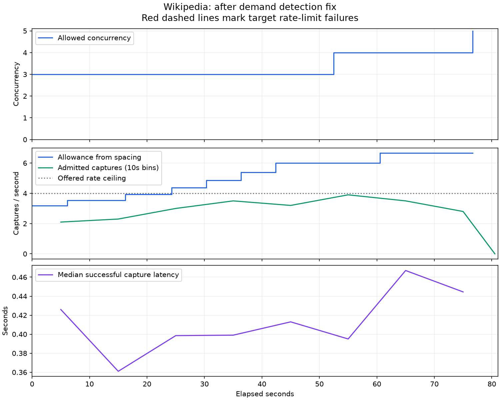
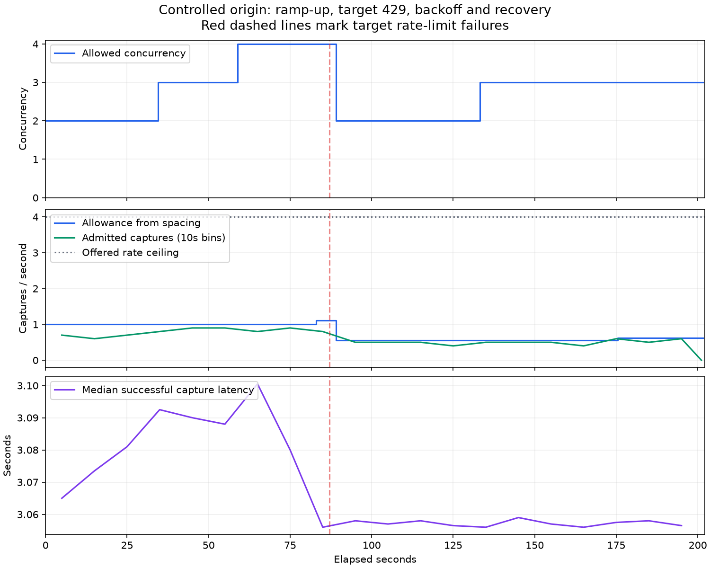

# Domain pacing load experiment — 2026-10-04

The real Wikipedia runs successfully exercised automatic ramp-up and persistent learned state.
Wikipedia returned **no target HTTP 429** at the tested load, so these runs do **not** establish
Wikipedia's rate limit or equilibrium. A separate controlled origin exercised a real HTTP 429,
immediate backoff, cooldown and healthy recovery through the same capture endpoint.

## Setup

- Local PostgreSQL, NATS, Squid egress and Browserless, with the Docker fleet controller running.
- A temporary API on `localhost:8412`, on the Compose networks so assigned browser DNS names resolve.
- Public `POST /v1/capture`, eight mock clients, at most four API calls per second. Clients honor
  Stolosio retry guidance and apply a shared pause on target rate limiting. Acquisition deadlines
  are 45 seconds; challenge resolution and paid fallback are disabled.
- Unmodified pacing settings: two concurrent captures, one-second spacing, 20 healthy samples,
  eight-concurrency ceiling, 0.1-second minimum spacing and 24-hour learned TTL.
- Production HTTP fetcher, browser verification, classifier and method cache. No fabricated
  cache evidence, artificial delays on Wikipedia, identity changes or egress rotation.
- Small repeated article cohort; this measures a warm method-cache workload, not discovery of
  hundreds of previously unseen pages. Production browser canaries remain enabled.

Wikimedia's [robot policy](https://wikitech.wikimedia.org/wiki/Robot_policy) prefers cached canonical
article URLs, requires retry guidance to be honored, and publishes website limits below ten
concurrent requests and twenty requests/second, with additional restrictions on browser execution
above five requests/second. The experiment caps capture API calls at four/second. Capture limits
are not individual outgoing-request limits; redirects and browser assets generate additional
traffic. The experiment therefore makes no claim to have measured total Wikimedia request rate.
The article paths were permitted by Wikipedia's robots.txt. The REST summary path checked during
setup was disallowed by robots.txt and was not used for load; its attempted capture was refused
by Stolosio before any origin request.

## Results

| Run | Duration | Successful captures | Target rate-limit failures | Stolosio 429s | Ending allowance | Last 30s admitted rate |
| --- | ---: | ---: | ---: | ---: | --- | ---: |
| Wikipedia, initial | 274.95s | 400 | 0 | 672 | 3 concurrent, 0.31381s spacing | 2.03 captures/s |
| Wikipedia, after demand fix | 81.06s | 243 | 0 | 64 | 5 concurrent, 0.150094s spacing | 3.60 captures/s |
| Controlled origin | 202.19s | 125 | 1 | 618 | 3 concurrent, 1.62s spacing | 0.57 captures/s |

Every admitted Wikipedia capture succeeded: 643 across the two load runs. Median successful
capture durations were 0.397s and 0.407s. There were 20 browser attempts in the initial run and
12 in the repeat. Recorded HTTP/browser acquisition statuses were all 200; these counts exclude
redirect hops and browser subrequests. Stolosio 429s were gateway `domain_throttled` results,
not evidence that Wikipedia refused a request.

The repeat resumed the saved allowance instead of resetting to defaults. Allowed concurrency
progressed **2 → 3 → 4 → 5** across both runs. Spacing reached 0.150094 seconds, corresponding to
a theoretical spacing allowance of 6.66 capture starts/second. That theoretical allowance was
not tested at its maximum: offered load remained capped at four API calls/second.

After restarting the test API, the saved Wikipedia allowance remained five concurrent captures
with 0.150094-second spacing and the same TTL. Temporary fixture state was removed after testing;
Wikipedia's learned state was retained for subsequent local traffic.



### Bug exposed by live load

The initial run plateaued despite ongoing spacing refusals. At 0.31381-second spacing, clients
offering requests in 0.25-second increments often achieved 0.5-second admitted intervals. These
were outside the controller's `1.5 × spacing` pressure heuristic, so genuine unmet demand stopped
counting towards learning. The plateau was a client scheduling artifact, not origin equilibrium.

The fix persists a recent spacing refusal and consumes it as demand evidence on the next
admission. Evidence expires after the greater of two seconds and 1.5 times spacing. TTL/settings
resets clear it. Healthy acquisition is still required before increasing limits; refused calls
alone never increase the allowance. Regression tests verify both recent and stale demand.
The repeat passed the old plateau and reached 3.6 admitted captures/second in its last 30 seconds.

[Initial-run plot](wikipedia-pacing-initial-20261004.png)

### Controlled target refusal and recovery

The controlled origin permits three concurrent requests, with each successful request taking
three seconds. Additional requests return HTTP 429 with `Retry-After: 1`. It runs on a temporary
Docker-only public-address subnet following the existing E2E fixture pattern. Squid joins that
network; destination/port restrictions are unchanged. The fixture listens on permitted port 80.

Observed transitions:

| Elapsed | Applied concurrency | Applied spacing | Observation |
| ---: | ---: | ---: | --- |
| 0s | 2 | 1.0s | Product defaults |
| 34s | 3 | 1.0s | Healthy demand |
| 59s | 4 | 1.0s | Healthy demand |
| 83s | 4 | 0.9s | Increased start rate |
| 87s | 2 | 1.8s | Target HTTP 429; one-second cooldown |
| 133s | 3 | 1.8s | Healthy recovery |
| 175s | 3 | 1.62s | Gradual rate recovery |

The target 429 was returned as a completed capture (endpoint HTTP 200, website `rate_limited`),
while subsequent preemptive refusals used endpoint HTTP 429 and gateway `domain_throttled`.
This confirms the transport distinction, backoff and recovery. It does not prove a permanently
stable limit: the controller continues probing and can oscillate around a destination threshold.



## Evidence and reproduction

[Machine-readable summaries and policy transitions](pacing-20261004.json) contain bounded
acquisition facts and no page bodies. Detailed local logs are under
`/tmp/stolosio-wikipedia-pacing-20261004`, `/tmp/stolosio-wikipedia-pacing-20261004-fixed` and
`/tmp/stolosio-controlled-pacing-20261004-corrected`. Setup probes and the failed port-8080 fixture
attempt are excluded from successful load-run counts.

The reusable downstream load client is `scripts/pacing_load.py`:

```bash
uv run python scripts/pacing_load.py \
  --base-url http://localhost:8411 \
  --url https://en.wikipedia.org/wiki/Rate_limiting \
  --url https://en.wikipedia.org/wiki/Queueing_theory \
  --url https://en.wikipedia.org/wiki/Token_bucket \
  --duration 300 --offered-rps 4 --workers 8 --max-captures 400 \
  --output /tmp/stolosio-wikipedia-pacing
```

Use a Docker-network API and an active fleet controller for browser endpoint resolution.
Check the destination's current guidance before repeating. This client changes no policies.

Validation after the demand fix: **479 tests passed**, Ruff passed, and `alembic check` found no
schema drift. The experiment's applied migration adds `spacing_refused_at` without resetting
saved learned allowances.
